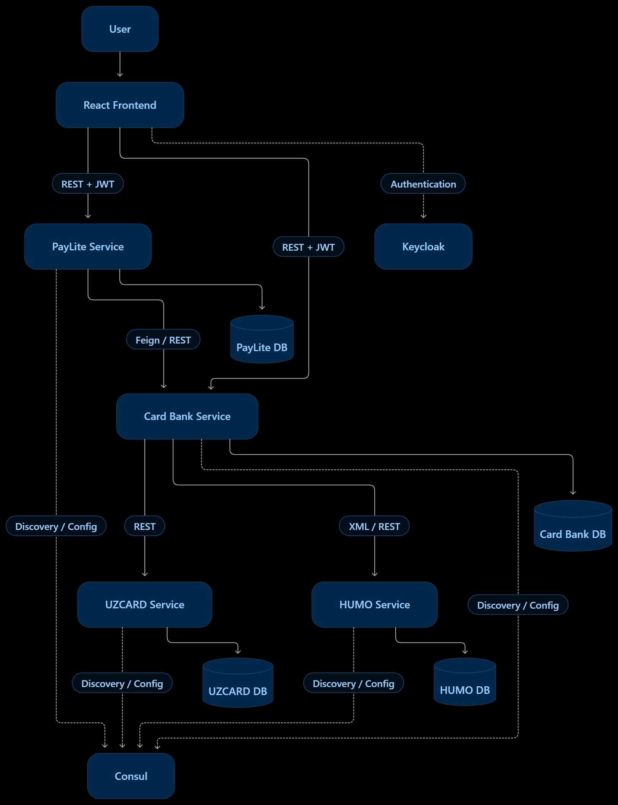

# PayLite P2P — Microservices

A microservices-based payment system for creating bank cards, managing card balances, and transferring money between UZCARD and HUMO cards.

> **Related project:** [PayLite Backend](https://github.com/Rahimjon-A/paylite)

## Architecture



### Services

| Component | Responsibility                                                               | Local URL               |
| --------- | ---------------------------------------------------------------------------- | ----------------------- |
| PayLite   | P2P transfers, commission calculation, and payment status management         | `http://localhost:8080` |
| Card Bank | Card creation, card information, and routing to the appropriate card network | `http://localhost:8081` |
| UZCARD    | UZCARD account and balance operations                                        | `http://localhost:8082` |
| HUMO      | HUMO account and balance operations                                          | `http://localhost:8083` |
| Frontend  | React web application for card and payment operations                        | `http://localhost:5173` |

### Infrastructure

| Component  | Purpose                                         | Local URL               |
| ---------- | ----------------------------------------------- | ----------------------- |
| PostgreSQL | Persistent storage for the services             | `localhost:5433`        |
| Keycloak   | Authentication and role-based access            | `http://localhost:9080` |
| Consul     | Service discovery and centralized configuration | `http://localhost:8500` |

Each backend service maintains its own database.

## Technology Stack

- **Backend:** Java 17, Spring Boot, Spring Data JPA, Maven
- **Frontend:** React, TypeScript, Vite
- **Database:** PostgreSQL
- **Database migrations:** Liquibase
- **Authentication:** Keycloak, OAuth 2.0 / OpenID Connect, JWT
- **Service communication:** REST, OpenFeign
- **Service discovery and configuration:** Consul
- **Infrastructure:** Docker Compose

## How Services Communicate

1. The frontend authenticates users through Keycloak and sends authorized API requests using JWT bearer tokens.
2. PayLite handles P2P transfers, validates balances, calculates commissions, and coordinates the payment flow.
3. Card Bank manages card metadata and routes card operations to the appropriate network service.
4. UZCARD and HUMO manage their respective card accounts and balances.
5. Services communicate through REST APIs, with OpenFeign used for backend service calls.
6. Consul provides service discovery and centralized configuration.

### P2P Transfer Flow

```text
Frontend
   |
   v
PayLite Service
   |
   +----> Card Bank: Retrieve card information
   |
   +----> Calculate commission and validate transfer
   |
   +----> Withdraw from sender's card network
   |
   +----> Deposit to recipient's card network
   |
   v
Return transfer result
```

If a recipient-side payment fails after the sender has been charged, PayLite's compensation flow attempts to reverse the sender-side operation.

## Getting Started

### Prerequisites

- JDK 17
- Node.js and npm
- Docker Desktop
- Git
- Maven, or the Maven Wrapper included in the backend projects

### 1. Start Infrastructure

Open a terminal in the `infrastructure` directory:

```powershell
cd infrastructure
docker compose up -d
```

Check the running containers:

```powershell
docker compose ps
```

The Compose configuration is responsible for starting the shared infrastructure, including PostgreSQL, Keycloak, and Consul.

The database initialization script is located at:

```text
infrastructure/postgres/init-multiple-databases.sh
```

The Keycloak realm configuration is located at:

```text
infrastructure/realm-config/paylite-realm.json
```

### 2. Start the Backend Services

Run each backend service in a separate terminal from the `microservices` directory.

**PayLite**

```powershell
cd paylite
.\mvnw.cmd spring-boot:run
```

**Card Bank**

```powershell
cd microservices/card-bank-service
.\mvnw.cmd spring-boot:run
```

**UZCARD**

```powershell
cd microservices/uzcard-service
.\mvnw.cmd spring-boot:run
```

**HUMO**

```powershell
cd microservices/humo-service
.\mvnw.cmd spring-boot:run
```

Run each command from the corresponding service directory. If a service requires a specific Spring profile, environment variables, or additional configuration, use the settings defined in that service's configuration files.

### 3. Start the Frontend

Open another terminal:

```powershell
cd microservices/paylite-front
npm install
npm run dev
```

Open the frontend at:

`http://localhost:5173`

Make sure the Keycloak realm, frontend client, API URLs, and backend configurations match your local environment before testing.

## API Endpoints

All endpoints below use the local backend URLs shown in the architecture table.

### PayLite Service — Port 8080

| Method | Endpoint                      | Description                                      |
| ------ | ----------------------------- | ------------------------------------------------ |
| `POST` | `/api/p2p`                    | Execute a P2P transfer                           |
| `POST` | `/api/p2p/commission-preview` | Preview the commission and total transfer amount |

Example P2P request:

```json
{
  "requestId": "unique-request-id",
  "amount": 100000,
  "fromPan": "8600000000000000",
  "toPan": "9860000000000000"
}
```

**Note:** `amount` is expressed in tiyin. The PAN values above are illustrative; use valid cards created in your environment.

### Card Bank Service — Port 8081

| Method | Endpoint                    | Description                        |
| ------ | --------------------------- | ---------------------------------- |
| `POST` | `/api/cards`                | Create a card                      |
| `GET`  | `/api/cards/{pan}`          | Retrieve card information          |
| `GET`  | `/api/cards/{pan}/balance`  | Retrieve the card balance          |
| `POST` | `/api/cards/{pan}/deposit`  | Deposit money into a card account  |
| `POST` | `/api/cards/{pan}/withdraw` | Withdraw money from a card account |

The deposit, withdrawal, and balance routes should be checked against the current implementation before relying on them.

### UZCARD and HUMO Services

Both services provide card-account operations for their respective networks, including balance retrieval, deposits, withdrawals, and transfers.

The exact routes and request formats are defined by each service's REST controllers. HUMO communication uses XML for relevant requests and responses.

For the complete API contracts, inspect the controllers in each service or use the Swagger/OpenAPI UI if enabled.

## Commission Configuration

Commission settings are maintained in Consul's Key/Value store.

### P2P Commission Rules

Key: `config/paylite-service/data`

```yaml
paylite:
  commission:
    uzcard-to-uzcard: 0
    uzcard-to-humo: 1
    humo-to-uzcard: 1
    humo-to-humo: 2
```

These values configure the commission rules for each card-network combination.

### Application Payment Commission

```yaml
application:
  payment:
    commission-percent: 1.5
```

This setting defines the application payment commission percentage. Keep it distinct from the network-specific P2P commission rules.

Open Consul at `http://localhost:8500` to inspect or update the stored configuration.

## Authentication

Keycloak is available at:

`http://localhost:9080`

The project uses the `paylite` realm for authentication and authorization. Backend API requests should include an access token:

```http
Authorization: Bearer YOUR_ACCESS_TOKEN
```

The realm export is located at `infrastructure/realm-config/paylite-realm.json`.

Never commit real credentials, access tokens, or production secrets to the repository.

## Project Structure

```text
microservices/
├── card-bank-service/    # Card management and routing
├── humo-service/         # HUMO account operations
├── infrastructure/
│   ├── docker-compose.yml
│   ├── postgres/
│   │   └── init-multiple-databases.sh
│   └── realm-config/
│       ├── keycloak-health-check.sh
│       └── paylite-realm.json
├── paylite-front/        # React frontend
├── uzcard-service/       # UZCARD account operations
├── diagram.png           # Architecture diagram
├── .gitignore
└── README.md
```

## Troubleshooting

- **Port already in use:** Check whether another process is using the required port.
- **Database connection failure:** Confirm PostgreSQL is running and that the service's datasource configuration matches the database credentials and port.
- **Keycloak authentication failure:** Verify the realm, client configuration, issuer URL, and redirect URIs.
- **Service discovery failure:** Check Consul at `http://localhost:8500` and verify each service's registered name.
- **Frontend API errors:** Verify the configured backend URLs and CORS settings.
- **Service startup failure:** Check the service logs and confirm infrastructure is healthy before starting the application.
